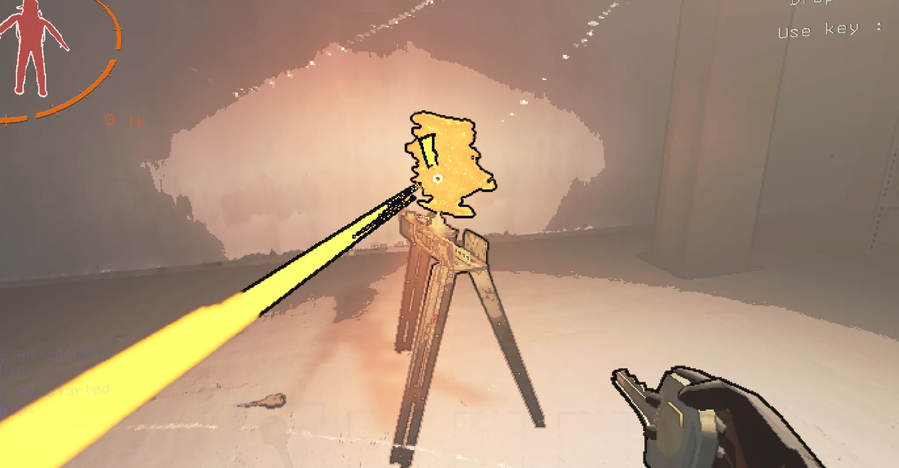

# 게임 보안 및 공격과 방어

개인적으로 분석한 결과를 공유하고, Unity 기반 게임의 보안 취약점을 찾고 이를 방어하는 방법을 정리합니다.

본 프로젝트는 크게 **3개 파트**로 구성되어 있습니다.

## 프로젝트 개요

1. Unity Mono 방식의 내부 구조와 취약점을 이해
2. 실제 게임 DLL을 분석하고 핵(hack) 을 구현
3. 치트 엔진·DLL 인젝션 을 방어하는 안티치트 시스템 개발

## 게임 환경

- 리썰 컴퍼니
- Unity
- C# 스크립트(Mono) 빌드

**카테고리**

---

1. Unity Mono 방식과 보안 취약점
    - Unity 스크립트 컴파일 & 실행 파이프라인
    - Mono 런타임 아키텍처
    - IL코드의 가시성 & 역공학 용이성
    - Mono 방식의 보안상 한계
    - 대표적인 Mono 취약점 공격 기법
2. 코드 분석 & 핵 개발
    - 무적 핵
    - 무한 점프
    - 무한 스테미너
    - 돈 무한
3. 안티 치트 엔진 개발
    - cheat engine 감지
    - dll injection 감지


---

# 1. Unity Mono 방식과 보안 취약점

### 1.1. Unity 스크립트 컴파일 & 실행 파이프라인

1. **C# 스크립트 작성 → IL 코드 생성**
    - 사용자가 작성한 C# 스크립트(`.cs` 파일)는 Unity 에디터나 빌드 과정에서 Roslyn C# 컴파일러를 통해 **중간 언어(IL: Intermediate Language)** 로 컴파일된다.
    - 이 IL 코드는 .NET 표준 명령어들의 집합으로, 플랫폼에 종속되지 않는 형태로 저장된다.
2. **Assembly(.dll) 패키징**
    - 컴파일된 IL은 `Assembly-CSharp.dll`, `Assembly-CSharp-firstpass.dll` 등의 이름으로 Unity 프로젝트의 **Managed** 폴더에 패키징된다.
    - 이때 사용자 스크립트 외에도 `UnityEngine.dll`, `UnityEngine.UI.dll` 등 엔진 기본 어셈블리가 함께 포함된다.
3. **Mono 런타임 로딩 & JIT 컴파일**
    - 실행 시 Unity 런처(`mono.dll` 또는 `mono-2.0-bdwgc.dll`)가 로드되고, 해당 어셈블리들을 메모리에 올린다.
    - Mono의 **JIT(Just-In-Time) 컴파일러**가 IL 코드를 네이티브 CPU 명령어로 변환하여 실제로 실행 가능한 상태로 만든다.
4. **Managed 객체 & 가비지 컬렉션**
    - IL 코드가 생성한 모든 객체(`MonoBehaviour`, `GameObject`, `Component` 등)는 Mono 런타임의 **가비지 컬렉터(GC)** 에 의해 관리된다.
    - 사용하지 않는 객체는 자동으로 메모리에서 해제되어 메모리 누수 위험을 줄여 준다.

---

### 1.2. Mono 런타임 아키텍처

- **Class Loader**
    - 어셈블리(.dll)의 메타데이터(타입, 메서드, 속성 등)를 분석해 런타임 타입 정보를 구성한다.
- **JIT Compiler**
    - IL → 네이티브 코드 변환 엔진. 필요할 때마다 메서드 단위로 컴파일하여 성능을 최적화한다.
- **Execution Engine**
    - JIT된 코드를 스택 프레임에 올리고, 예외 처리, 쓰레드 스케줄링, 인터럽트 등을 관리한다.
- **Garbage Collector**
    - Mark-and-Sweep 알고리즘 기반. 참조가 끊긴 객체를 주기적으로 수집하여 메모리를 회수한다.
- **Reflection API**
    - 런타임에 타입, 메서드, 필드 등에 대한 정보를 얻고 호출할 수 있는 API를 제공한다. (예: `Type.GetMethod()`, `MethodInfo.Invoke()`)

---

### 1.3. IL 코드의 가시성 & 역공학 용이성

1. **IL → C# 디컴파일**
    - IL 코드는 dnSpy, ILSpy 같은 도구로 손쉽게 **디컴파일**이 가능하다.
    - 원본 C# 소스와 매우 유사한 형태로 복원되며, 메서드 이름, 변수 이름, 클래스 구조가 거의 그대로 드러난다.
2. **심볼 정보(.pdb) 활용**
    - 개발 빌드 시 디버그 심볼(.pdb)을 함께 배포하면, **라인 단위 디버깅**도 가능해져 해커가 코드 흐름을 더욱 정밀하게 추적할 수 있다.
3. **런타임 후킹 & 메서드 교체**
    - MonoMod, Harmony 같은 라이브러리를 이용해 런타임에 **메서드를 가로채거나 대체**할 수 있다.
    - 예: `Player.TakeDamage()`를 후킹해 무적 모드 적용, `Update()` 호출 자체를 무시 등.

---

### 1.4. Mono 방식의 보안상 한계

1. **클라이언트 신뢰성 부재**
    - 게임 로직이 전부 클라이언트 측(.dll)에서 실행되므로, **클라이언트가 조작되면 무력화**된다.
2. **무결성 검사 어려움**
    - IL 코드를 실행 중에 검사하려면 주기적으로 SHA256 해시를 비교해야 하지만, 이 검사 로직도 쉽게 우회될 수 있다.
3. **Reflection 남용 위험**
    - Reflection으로 private 메서드·필드에 접근 가능 → **은폐된 로직이 없음**.

---

### 1.5. 대표적인 Mono 취약점 공격 기법

1. DLL 패치
    - `Assembly-CSharp.dll`을 직접 역디컴파일 → 코드 삽입 → 재패키징
2. SharpMonoInjector
    - 메모리 상에 로드된 Mono 런타임에 DLL을 주입, 메서드 후킹 적용
3. **Cheat Engine**
    - Mono 모듈을 검색해 함수 호출 스택·변수값 직접 조작
4. **Harmony Patching**
    - 런타임에 Harmony 라이브러리로 메서드 프리/포스트 패치
5. **Memory Read/Write**
    - `ReadProcessMemory`/`WriteProcessMemory` API 호출로 변수 변경
  

---
# 2. 코드 분석 & 핵 개발

## 2.1. 무적 핵

### 2.1.1. 일부 몬스터 & 낙하 데미지

```c
public void DamagePlayer(int damageNumber, bool hasDamageSFX = true, bool callRPC = true, CauseOfDeath causeOfDeath = CauseOfDeath.Unknown, int deathAnimation = 0, bool fallDamage = false, Vector3 force = default(Vector3))
		{
			if (!base.IsOwner)
			{
				return;
			}
			if (this.isPlayerDead)
			{
				return;
			}
			if (!this.AllowPlayerDeath())
			{
				return;
			}
			if (this.health - damageNumber <= 0 && !this.criticallyInjured && damageNumber < 50)
			{
				this.health = 5;
			}
			else
			{
				this.health = Mathf.Clamp(this.health - damageNumber, 0, 100);
			}
			HUDManager.Instance.UpdateHealthUI(this.health, true);
			if (this.health <= 0)
			{
				this.KillPlayer(force, true, causeOfDeath, deathAnimation, default(Vector3));
			}
			else
			{
				if (this.health < 10 && !this.criticallyInjured)
				{
					HUDManager.Instance.ShakeCamera(ScreenShakeType.Big);
					this.MakeCriticallyInjured(true);
				}
				else
				{
					if (damageNumber >= 10)
					{
						this.sprintMeter = Mathf.Clamp(this.sprintMeter + (float)damageNumber / 125f, 0f, 1f);
					}
					if (callRPC)
					{
						if (base.IsServer)
						{
							this.DamagePlayerClientRpc(damageNumber, this.health);
						}
						else
						{
							this.DamagePlayerServerRpc(damageNumber, this.health);
						}
					}
				}
				if (fallDamage)
				{
					HUDManager.Instance.UIAudio.PlayOneShot(StartOfRound.Instance.fallDamageSFX, 1f);
					WalkieTalkie.TransmitOneShotAudio(this.movementAudio, StartOfRound.Instance.fallDamageSFX, 1f);
					this.BreakLegsSFXClientRpc();
				}
				else if (hasDamageSFX)
				{
					HUDManager.Instance.UIAudio.PlayOneShot(StartOfRound.Instance.damageSFX, 1f);
				}
			}
			StartOfRound.Instance.LocalPlayerDamagedEvent.Invoke();
			this.takingFallDamage = false;
			if (!this.inSpecialInteractAnimation && !this.twoHandedAnimation)
			{
				this.playerBodyAnimator.SetTrigger("Damage");
			}
			this.specialAnimationWeight = 1f;
			this.PlayQuickSpecialAnimation(0.7f);
		}
```

해당 코드에서 health ≤ 0 인 경우 killplayer 함수를 실행시켜 플레이어를 사망시킨다.

killplayer를 호출시키지 않거나 health가 줄어드는 값을 고정시킨다

`this.health = Mathf.Clamp(this.health - damageNumber, 0, 100);` 이 부분을 

`this.health = 5` 로 세팅한다. 


이후 체력이 5에서 내려가지 않고 사망하지 않게 된다.

슬라임 케이스


마찬가지로 체력 5에서 내려가지 않아 죽지 않는다.

### 2.1.2. 터렛으로 인한 사망

수정전 Turret 코드

```c
case TurretMode.Firing:
			if (this.turretModeLastFrame != TurretMode.Firing)
			{
				this.turretModeLastFrame = TurretMode.Firing;
				this.berserkAudio.Stop();
				RoundManager.Instance.PlayAudibleNoise(this.mainAudio.transform.position, 15f, 0.9f, 0, false, 0);
				this.mainAudio.clip = this.firingSFX;
				this.mainAudio.Play();
				this.farAudio.clip = this.firingFarSFX;
				this.farAudio.Play();
				this.bulletParticles.Play(true);
				this.bulletCollisionAudio.Play();
				if (this.fadeBulletAudioCoroutine != null)
				{
					base.StopCoroutine(this.fadeBulletAudioCoroutine);
				}
				this.bulletCollisionAudio.volume = 1f;
				this.rotatingSmoothly = false;
				this.lostLOSTimer = 0f;
				this.turretAnimator.SetInteger("TurretMode", 2);
			}
			if (this.turretInterval >= 0.21f)
			{
				this.turretInterval = 0f;
				if (this.CheckForPlayersInLineOfSight(3f, false) == GameNetworkManager.Instance.localPlayerController)
				{
					if (GameNetworkManager.Instance.localPlayerController.health > 50)
					{
						GameNetworkManager.Instance.localPlayerController.DamagePlayer(50, true, true, CauseOfDeath.Gunshots, 0, false, default(Vector3));
					}
					else
					{
						GameNetworkManager.Instance.localPlayerController.KillPlayer(this.aimPoint.forward * 40f, true, CauseOfDeath.Gunshots, 0, default(Vector3));
					}
				}
				this.shootRay = new Ray(this.aimPoint.position, this.aimPoint.forward);
				if (Physics.Raycast(this.shootRay, out this.hit, 30f, StartOfRound.Instance.collidersAndRoomMask, QueryTriggerInteraction.Ignore))
				{
					this.bulletCollisionAudio.transform.position = this.shootRay.GetPoint(this.hit.distance - 0.5f);
				}
			}
			else
			{
				this.turretInterval += Time.deltaTime;
			}
			break;
```

해당 부분에서 체력이 50 이하인 경우 killplayer를 호출하게 된다.

```c
else
					{
						GameNetworkManager.Instance.localPlayerController.KillPlayer(this.aimPoint.forward * 40f, true, CauseOfDeath.Gunshots, 0, default(Vector3));
					}
```

해당 부분을 없애게 되면 캐릭터가 사망하지 않게 된다.

수정후

```c
case TurretMode.Firing:
			if (this.turretModeLastFrame != TurretMode.Firing)
			{
				this.turretModeLastFrame = TurretMode.Firing;
				this.berserkAudio.Stop();
				RoundManager.Instance.PlayAudibleNoise(this.mainAudio.transform.position, 15f, 0.9f, 0, false, 0);
				this.mainAudio.clip = this.firingSFX;
				this.mainAudio.Play();
				this.farAudio.clip = this.firingFarSFX;
				this.farAudio.Play();
				this.bulletParticles.Play(true);
				this.bulletCollisionAudio.Play();
				if (this.fadeBulletAudioCoroutine != null)
				{
					base.StopCoroutine(this.fadeBulletAudioCoroutine);
				}
				this.bulletCollisionAudio.volume = 1f;
				this.rotatingSmoothly = false;
				this.lostLOSTimer = 0f;
				this.turretAnimator.SetInteger("TurretMode", 2);
			}
			if (this.turretInterval >= 0.21f)
			{
				this.turretInterval = 0f;
				if (this.CheckForPlayersInLineOfSight(3f, false) == GameNetworkManager.Instance.localPlayerController && GameNetworkManager.Instance.localPlayerController.health > 50)
				{
					GameNetworkManager.Instance.localPlayerController.DamagePlayer(50, true, true, CauseOfDeath.Gunshots, 0, false, default(Vector3));
				}
				this.shootRay = new Ray(this.aimPoint.position, this.aimPoint.forward);
				if (Physics.Raycast(this.shootRay, out this.hit, 30f, StartOfRound.Instance.collidersAndRoomMask, QueryTriggerInteraction.Ignore))
				{
					this.bulletCollisionAudio.transform.position = this.shootRay.GetPoint(this.hit.distance - 0.5f);
				}
			}
			else
			{
				this.turretInterval += Time.deltaTime;
			}
			break;
```



### 2.1.3. 눈 없는 개(Eyeless dog)

```c
OnCollideWithPlayer() -> KillPlayerServerRpc() ->  KillPlayerClientRpc() -> KillPlayer(int playerId)
```

사망처리의 흐름 순서는 위와 같다.

즉 서버에 죽은 것을 전달하고 client에 적용된다.

currentBehaviourStateIndex가 3인 경우에 killPlayerServerRpc를 호출하게된다.  이 호출을 막게되면 사망하지 않게 된다.

수정전

```c
public override void OnCollideWithPlayer(Collider other)
	{
		base.OnCollideWithPlayer(other);
		PlayerControllerB playerControllerB = base.MeetsStandardPlayerCollisionConditions(other, this.inKillAnimation, false);
		if (playerControllerB != null)
		{
			VehicleController vehicleController = Object.FindObjectOfType<VehicleController>();
			if (vehicleController != null && playerControllerB.physicsParent != null && playerControllerB.physicsParent == vehicleController.transform && !vehicleController.backDoorOpen)
			{
				return;
			}
			Vector3 a = Vector3.Normalize((base.transform.position + Vector3.up - playerControllerB.gameplayCamera.transform.position) * 100f);
			RaycastHit raycastHit;
			if (Physics.Linecast(base.transform.position + Vector3.up + a * 0.5f, playerControllerB.gameplayCamera.transform.position, out raycastHit, StartOfRound.Instance.collidersAndRoomMask, QueryTriggerInteraction.Ignore))
			{
				if (raycastHit.collider == this.debugCollider)
				{
					return;
				}
				this.debugCollider = raycastHit.collider;
				return;
			}
			else
			{
				if (playerControllerB.inVehicleAnimation && Vector3.Distance(base.transform.position, playerControllerB.transform.position) > 3f)
				{
					return;
				}
				if (this.currentBehaviourStateIndex == 3)
				{
					playerControllerB.inAnimationWithEnemy = this;
					this.KillPlayerServerRpc((int)playerControllerB.playerClientId);
					return;
				}
				if (this.currentBehaviourStateIndex == 0 || this.currentBehaviourStateIndex == 1)
				{
					this.ChaseLocalPlayer();
					return;
				}
				if (this.currentBehaviourStateIndex == 2 && !this.inLunge)
				{
					base.transform.LookAt(other.transform.position);
					base.transform.localEulerAngles = new Vector3(0f, base.transform.eulerAngles.y, 0f);
					this.inLunge = true;
					this.EnterLunge();
				}
			}
		}
	}
```

수정후

```c
public override void OnCollideWithPlayer(Collider other)
	{
		base.OnCollideWithPlayer(other);
		PlayerControllerB playerControllerB = base.MeetsStandardPlayerCollisionConditions(other, this.inKillAnimation, false);
		if (playerControllerB != null)
		{
			Vector3 a = Vector3.Normalize((base.transform.position + Vector3.up - playerControllerB.gameplayCamera.transform.position) * 100f);
			RaycastHit raycastHit;
			if (Physics.Linecast(base.transform.position + Vector3.up + a * 0.5f, playerControllerB.gameplayCamera.transform.position, out raycastHit, StartOfRound.Instance.collidersAndRoomMask, QueryTriggerInteraction.Ignore))
			{
				if (raycastHit.collider == this.debugCollider)
				{
					return;
				}
				this.debugCollider = raycastHit.collider;
				return;
			}
			else
			{
				if (playerControllerB.inVehicleAnimation && Vector3.Distance(base.transform.position, playerControllerB.transform.position) > 3f)
				{
					return;
				}
				if (this.currentBehaviourStateIndex == 3)
				{
					playerControllerB.inAnimationWithEnemy = this;
					return;
				}
				if (this.currentBehaviourStateIndex == 0 || this.currentBehaviourStateIndex == 1)
				{
					this.ChaseLocalPlayer();
					return;
				}
				if (this.currentBehaviourStateIndex == 2 && !this.inLunge)
				{
					base.transform.LookAt(other.transform.position);
					base.transform.localEulerAngles = new Vector3(0f, base.transform.eulerAngles.y, 0f);
					this.inLunge = true;
					this.EnterLunge();
				}
			}
		}
	}
```


공격을 받아도 죽지 않게 된다.

### 2.1.4. 코일 헤드

sprintmanai 클래스를 보면 즉사가 아닌 90의 데미지를 주게된다.

체력 max가 100으로 설정되어 있고 두 번 맞으면 죽게된다.

하지만 위에서 Damage가 0이하로 내려가지 않도록 설정하고, 즉사가 아니기 때문에 수정하지 않아도 죽지 않게 된다.

```c
public override void OnCollideWithPlayer(Collider other)
	{
		base.OnCollideWithPlayer(other);
		if (this.stoppingMovement)
		{
			return;
		}
		if (this.currentBehaviourStateIndex != 1)
		{
			return;
		}
		if (this.hitPlayerTimer >= 0f)
		{
			return;
		}
		if (this.setOnCooldown)
		{
			return;
		}
		if ((double)(Time.realtimeSinceStartup - this.timeAtLastCooldown) < 0.45)
		{
			return;
		}
		PlayerControllerB playerControllerB = base.MeetsStandardPlayerCollisionConditions(other, false, false);
		if (playerControllerB != null)
		{
			this.hitPlayerTimer = 0.2f;
			playerControllerB.DamagePlayer(90, true, true, CauseOfDeath.Mauling, 2, false, default(Vector3));
			playerControllerB.JumpToFearLevel(1f, true);
			this.timeSinceHittingPlayer = Time.realtimeSinceStartup;
		}
	}
```

### 2.1.5. 가면 몬스터

```c
OnCollideWithPlayer → KillPlayerAnimationServerRpc → KillPlayerAnimationClientRpc → killAnimation → KillPlayer() → FinishKillAnimation
```

MaskedPlayerEnemy 클래스를 확인하면 플레이어와 충돌했을 때 아래와 같은 순서로 사망처리가 된다.

플레이어 객체인지를 확인한 후 죽이는 에니메이션을 실행하는데 애니메이션 자체를 실행시키지 않도록 한다.

수정전

```c
public override void OnCollideWithPlayer(Collider other)
	{
		base.OnCollideWithPlayer(other);
		if (this.stunNormalizedTimer >= 0f)
		{
			return;
		}
		if (this.isEnemyDead)
		{
			return;
		}
		if (Time.realtimeSinceStartup - this.timeAtLastUsingEntrance < 1.75f)
		{
			return;
		}
		PlayerControllerB playerControllerB = base.MeetsStandardPlayerCollisionConditions(other, this.inKillAnimation || this.startingKillAnimationLocalClient || !this.enemyEnabled, false);
		if (playerControllerB != null)
		{
			this.startingKillAnimationLocalClient = true;
			this.KillPlayerAnimationServerRpc((int)playerControllerB.playerClientId);
		}
	}
```

수정후

```c
public override void OnCollideWithPlayer(Collider other)
	{
		base.OnCollideWithPlayer(other);
		if (this.stunNormalizedTimer >= 0f)
		{
			return;
		}
		if (this.isEnemyDead)
		{
			return;
		}
		if (Time.realtimeSinceStartup - this.timeAtLastUsingEntrance < 1.75f)
		{
			return;
		}
		PlayerControllerB playerControllerB = base.MeetsStandardPlayerCollisionConditions(other, this.inKillAnimation || this.startingKillAnimationLocalClient || !this.enemyEnabled, false);
		if (playerControllerB != null)
		{
			this.startingKillAnimationLocalClient = true;
			this.KillPlayerAnimationServerRpc((int)playerControllerB.playerClientId);
		}
	}
```

### 2.1.6. 플레이어 사망처리 없애기

사망 자체를 하지 않도록 KillPlayer 함수를 없애는 방법이 있지만 해당 방법은 여러 코드의 상호관계를 파악하지 않는 것이기 때문에 문제가 발생하기도 한다.

ex) 사망 애니메이션이 나왔는데 죽지 않아 무한 루프

수정전

```c
public void KillPlayer(Vector3 bodyVelocity, bool spawnBody = true, CauseOfDeath causeOfDeath = CauseOfDeath.Unknown, int deathAnimation = 0, Vector3 positionOffset = default(Vector3))
		{
			if (!base.IsOwner)
			{
				return;
			}
			if (this.isPlayerDead)
			{
				return;
			}
			if (!this.AllowPlayerDeath())
			{
				return;
			}
			this.isPlayerDead = true;
			this.isPlayerControlled = false;
			this.thisPlayerModelArms.enabled = false;
			this.localVisor.position = this.playersManager.notSpawnedPosition.position;
			this.DisablePlayerModel(base.gameObject, false, false);
			this.isInsideFactory = false;
			this.IsInspectingItem = false;
			this.inTerminalMenu = false;
			this.twoHanded = false;
			this.carryWeight = 1f;
			this.fallValue = 0f;
			this.fallValueUncapped = 0f;
			this.takingFallDamage = false;
			this.isSinking = false;
			this.isUnderwater = false;
			StartOfRound.Instance.drowningTimer = 1f;
			HUDManager.Instance.setUnderwaterFilter = false;
			this.wasUnderwaterLastFrame = false;
			this.sourcesCausingSinking = 0;
			this.sinkingValue = 0f;
			this.hinderedMultiplier = 1f;
			this.isMovementHindered = 0;
			this.inAnimationWithEnemy = null;
			this.positionOfDeath = base.transform.position;
			if (spawnBody)
			{
				Debug.DrawRay(base.transform.position, base.transform.up * 3f, Color.red, 10f);
				this.SpawnDeadBody((int)this.playerClientId, bodyVelocity, (int)causeOfDeath, this, deathAnimation, null, positionOffset);
			}
			this.SetInSpecialMenu(false, SpecialHUDMenu.BeltBagInventory);
			this.physicsParent = null;
			this.overridePhysicsParent = null;
			this.lastSyncedPhysicsParent = null;
			StartOfRound.Instance.CurrentPlayerPhysicsRegions.Clear();
			base.transform.SetParent(this.playersManager.playersContainer);
			this.CancelSpecialTriggerAnimations();
			this.ChangeAudioListenerToObject(this.playersManager.spectateCamera.gameObject);
			SoundManager.Instance.SetDiageticMixerSnapshot(0, 1f);
			HUDManager.Instance.SetNearDepthOfFieldEnabled(true);
			HUDManager.Instance.HUDAnimator.SetBool("biohazardDamage", false);
			Debug.Log("Running kill player function for LOCAL client, player object: " + base.gameObject.name);
			HUDManager.Instance.gameOverAnimator.SetTrigger("gameOver");
			HUDManager.Instance.HideHUD(true);
			this.StopHoldInteractionOnTrigger();
			this.KillPlayerServerRpc((int)this.playerClientId, spawnBody, bodyVelocity, (int)causeOfDeath, deathAnimation, positionOffset);
			StartOfRound.Instance.SwitchCamera(StartOfRound.Instance.spectateCamera);
			this.isInGameOverAnimation = 1.5f;
			this.cursorTip.text = "";
			this.cursorIcon.enabled = false;
			this.DropAllHeldItems(spawnBody, false);
			this.DisableJetpackControlsLocally();
		}
```

수정후

```c
public void KillPlayer(Vector3 bodyVelocity, bool spawnBody = true, CauseOfDeath causeOfDeath = CauseOfDeath.Unknown, int deathAnimation = 0, Vector3 positionOffset = default(Vector3))
		{
			return;
		}
```

### 2.1.7 추가 몬스터 관련 클래스

- `ButlerEnemyAI` → 집사
- `EnemyAICollisionDetect` → 적과의 충돌 감지
- `EnemyAINestSpawnObject` → 적 스폰(둥지 관련)
- `EnemyType` → 적의 유형 정의
- `MaskedPlayerEnemy` → 가면맨
- `MouthDogAI` → 포자 도마뱀
- `NutcrackerEnemyAI` → 호두까기 인형
- `RadMechAI` → 올드 버드
- `SandSpiderAI` → 벙커 거미
- `SandWormAI` → 모래 벌레형 괴물
- `SpringManAI` → 코일 헤드

## 2.2. 무한 점프

- 무한 점프를 구현하기 위해서는 현재 점프 입력에서 플레이어가 지면에 있거나 근처에 있어야 한다는 조건을 제거해야 한다.
- PlyaerControllerB 클래스에서 Jump_performed 부분이다.

수정전

```c
private void Jump_performed(InputAction.CallbackContext context)
		{
			if (this.quickMenuManager.isMenuOpen)
			{
				return;
			}
			if ((!base.IsOwner || !this.isPlayerControlled || (base.IsServer && !this.isHostPlayerObject)) && !this.isTestingPlayer)
			{
				return;
			}
			if (this.inSpecialInteractAnimation)
			{
				return;
			}
			if (this.isTypingChat)
			{
				return;
			}
			if (this.isMovementHindered > 0 && !this.isUnderwater)
			{
				return;
			}
			if (this.isExhausted)
			{
				return;
			}
			if ((this.thisController.isGrounded || (!this.isJumping && this.IsPlayerNearGround())) && !this.isJumping && (!this.isPlayerSliding || this.playerSlidingTimer > 2.5f) && !this.isCrouching)
			{
				this.playerSlidingTimer = 0f;
				this.isJumping = true;
				this.sprintMeter = Mathf.Clamp(this.sprintMeter - 0.08f, 0f, 1f);
				StartOfRound.Instance.PlayerJumpEvent.Invoke(this);
				this.PlayJumpAudio();
				if (this.jumpCoroutine != null)
				{
					base.StopCoroutine(this.jumpCoroutine);
				}
				this.jumpCoroutine = base.StartCoroutine(this.PlayerJump());
				if (StartOfRound.Instance.connectedPlayersAmount != 0)
				{
					this.PlayerJumpedServerRpc();
				}
			}
		}
```

- 점프가 된 동안에는 점프가 되지 않는 조건을 없애준다.
- 조건문들에 걸리게 되면 점프가 되지 않고 return하게 된다.

수정후

```c
private void Jump_performed(InputAction.CallbackContext context)
		{
			bool isMenuOpen = this.quickMenuManager.isMenuOpen;
			if (!base.IsOwner || !this.isPlayerControlled || (base.IsServer && !this.isHostPlayerObject))
			{
				bool flag = this.isTestingPlayer;
			}
			bool flag2 = this.inSpecialInteractAnimation;
			if (this.isTypingChat)
			{
				return;
			}
			if (this.isMovementHindered > 0)
			{
				bool flag3 = this.isUnderwater;
			}
			bool flag4 = this.isExhausted;
			
				this.playerSlidingTimer = 0f;
				this.sprintMeter = Mathf.Clamp(this.sprintMeter - 0.08f, 0f, 1f);
				StartOfRound.Instance.PlayerJumpEvent.Invoke(this);
				this.PlayJumpAudio();
				if (this.jumpCoroutine != null)
				{
					base.StopCoroutine(this.jumpCoroutine);
				}
				this.jumpCoroutine = base.StartCoroutine(this.PlayerJump());
				if (StartOfRound.Instance.connectedPlayersAmount != 0)
				{
					this.PlayerJumpedServerRpc();
				
			}
		}
```


## 2.3. 무한 스테미너

- 뛰는 것에 스테미너 제한이 걸려있다
- isSprinting 코드는 아래와 같다.

수정전

```c
if (this.isSprinting)
					{
						this.sprintMeter = Mathf.Clamp(this.sprintMeter - Time.deltaTime / this.sprintTime * this.carryWeight * num3, 0f, 1f);
					}
					else if (this.isMovementHindered > 0)
					{
						if (this.isWalking)
						{
							this.sprintMeter = Mathf.Clamp(this.sprintMeter - Time.deltaTime / this.sprintTime * num3 * 0.5f, 0f, 1f);
						}
					}
					else
					{
						if (!this.isWalking)
						{
							this.sprintMeter = Mathf.Clamp(this.sprintMeter + Time.deltaTime / (this.sprintTime + 4f) * num3, 0f, 1f);
						}
						else
						{
							this.sprintMeter = Mathf.Clamp(this.sprintMeter + Time.deltaTime / (this.sprintTime + 9f) * num3, 0f, 1f);
						}
						if (this.isExhausted && this.sprintMeter > 0.2f)
						{
							this.isExhausted = false;
						}
					}
```

수정후

```c
if (!this.isSprinting)
					{
						if (this.isMovementHindered > 0)
						{
							if (this.isWalking)
							{
							}
						}
						else
						{
							if (!this.isWalking)
							{
								this.sprintMeter = Mathf.Clamp(this.sprintMeter + Time.deltaTime / (this.sprintTime + 4f) * num3, 0f, 1f);
							}
							else
							{
								this.sprintMeter = Mathf.Clamp(this.sprintMeter + Time.deltaTime / (this.sprintTime + 9f) * num3, 0f, 1f);
							}
							if (this.isExhausted && this.sprintMeter > 0.2f)
							{
								this.isExhausted = false;
							}
						}
					}
```

## 2.4. 무한 돈

### 2.4.1. 시작 자금 변경

- 아래는 시작 자금이 60원으로 세팅된 값이다.
- 60을 50000으로 변경하면 값이 변하지만, 결국 줄어들어 어느 순간 구매에 제한이 걸린다.

수정전

```c
using System;
using UnityEngine;

// Token: 0x020000CD RID: 205
[Serializable]
public class QuotaSettings
{
	// Token: 0x040008CA RID: 2250
	[Tooltip("The starting profit quota")]
	public int startingQuota = 300;

	// Token: 0x040008CB RID: 2251
	public int startingCredits = 60;

	// Token: 0x040008CC RID: 2252
	public int deadlineDaysAmount = 4;

	// Token: 0x040008CD RID: 2253
	[Space(5f)]
	[Tooltip("Higher value means a less steep exponential increase")]
	public float increaseSteepness = 4f;

	// Token: 0x040008CE RID: 2254
	[Tooltip("The minimum amount to increase")]
	public float baseIncrease = 200f;

	// Token: 0x040008CF RID: 2255
	[Tooltip("A random Y coordinate on this line is picked and multiplied with the increase amount")]
	public AnimationCurve randomizerCurve;

	// Token: 0x040008D0 RID: 2256
	[Tooltip("This determines the severity of the randomizer curve")]
	public float randomizerMultiplier = 1f;
}

```

수정후

```c
using System;
using UnityEngine;

// Token: 0x020000CD RID: 205
[Serializable]
public class QuotaSettings
{
	// Token: 0x040008CA RID: 2250
	[Tooltip("The starting profit quota")]
	public int startingQuota = 300;

	// Token: 0x040008CB RID: 2251
	public int startingCredits = 50000;

	// Token: 0x040008CC RID: 2252
	public int deadlineDaysAmount = 4;

	// Token: 0x040008CD RID: 2253
	[Space(5f)]
	[Tooltip("Higher value means a less steep exponential increase")]
	public float increaseSteepness = 4f;

	// Token: 0x040008CE RID: 2254
	[Tooltip("The minimum amount to increase")]
	public float baseIncrease = 200f;

	// Token: 0x040008CF RID: 2255
	[Tooltip("A random Y coordinate on this line is picked and multiplied with the increase amount")]
	public AnimationCurve randomizerCurve;

	// Token: 0x040008D0 RID: 2256
	[Tooltip("This determines the severity of the randomizer curve")]
	public float randomizerMultiplier = 1f;
}

```

### 2.4.2. 구매 가격 제한 해제

- Terminal 클래스 부분에서 구매를 할 때 돈(크레딧)을 확인하는 코드가 존재한다.
- 돈(크레딧)이 부족으로 구매가 거부되는 로직을 제거한다.

```c
private void LoadNewNodeIfAffordable(TerminalNode node)
	{
		StartOfRound startOfRound = Object.FindObjectOfType<StartOfRound>();
		if (node.buyRerouteToMoon != -1 && node.buyRerouteToMoon != -2)
		{
			if (!startOfRound.inShipPhase || startOfRound.travellingToNewLevel)
			{
				this.LoadNewNode(this.terminalNodes.specialNodes[3]);
				return;
			}
			this.playerDefinedAmount = 1;
		}
		else if (node.shipUnlockableID != -1)
		{
			this.playerDefinedAmount = 1;
		}
		if (this.useCreditsCooldown)
		{
			this.LoadNewNode(this.terminalNodes.specialNodes[5]);
			return;
		}
		if (node.buyItemIndex != -1)
		{
			if (node.buyItemIndex != -7)
			{
				this.totalCostOfItems = (int)((float)this.buyableItemsList[node.buyItemIndex].creditsWorth * ((float)this.itemSalesPercentages[node.buyItemIndex] / 100f) * (float)this.playerDefinedAmount);
			}
			else
			{
				this.totalCostOfItems = node.itemCost * this.playerDefinedAmount;
			}
		}
		else if (node.buyVehicleIndex != -1)
		{
			int num = this.buyableItemsList.Length + node.buyVehicleIndex;
			this.totalCostOfItems = (int)((float)node.itemCost * ((float)this.itemSalesPercentages[num] / 100f));
		}
		else if (node.buyRerouteToMoon != -1 || node.shipUnlockableID != -1)
		{
			this.totalCostOfItems = node.itemCost;
		}
		float num2 = 0f;
		if (node.buyItemIndex != -1)
		{
			for (int i = 0; i < this.playerDefinedAmount; i++)
			{
				if (node.buyItemIndex == -7)
				{
					num2 += 9f;
				}
				else
				{
					num2 += 1f;
				}
			}
		}
		if (node.shipUnlockableID != -1)
		{
			if (node.shipUnlockableID >= StartOfRound.Instance.unlockablesList.unlockables.Count)
			{
				this.LoadNewNode(this.terminalNodes.specialNodes[16]);
				return;
			}
			UnlockableItem unlockableItem = StartOfRound.Instance.unlockablesList.unlockables[node.shipUnlockableID];
			if (unlockableItem.inStorage && (unlockableItem.hasBeenUnlockedByPlayer || unlockableItem.alreadyUnlocked) && (node.returnFromStorage || unlockableItem.maxNumber <= 1))
			{
				startOfRound.ReturnUnlockableFromStorageServerRpc(node.shipUnlockableID);
				this.LoadNewNode(this.terminalNodes.specialNodes[17]);
				return;
			}
		}
		if (this.groupCredits < this.totalCostOfItems && (node.buyVehicleIndex == -1 || !this.hasWarrantyTicket))
		{
			this.LoadNewNode(this.terminalNodes.specialNodes[2]);
			return;
		}
		if (this.playerDefinedAmount > 12 || num2 + (float)this.numberOfItemsInDropship > 12f)
		{
			this.LoadNewNode(this.terminalNodes.specialNodes[4]);
			return;
		}
		if (node.buyVehicleIndex != -1 && this.numberOfItemsInDropship > 0)
		{
			this.LoadNewNode(this.terminalNodes.specialNodes[27]);
			return;
		}
		if (this.vehicleInDropship && node.buyItemIndex != -1)
		{
			this.LoadNewNode(this.terminalNodes.specialNodes[25]);
			return;
		}
		if (node.buyVehicleIndex != -1)
		{
			if (this.vehicleInDropship || Object.FindObjectOfType<VehicleController>())
			{
				this.LoadNewNode(this.terminalNodes.specialNodes[26]);
				return;
			}
			ItemDropship itemDropship = Object.FindObjectOfType<ItemDropship>();
			if (itemDropship != null && itemDropship.deliveringVehicle)
			{
				this.LoadNewNode(this.terminalNodes.specialNodes[26]);
				return;
			}
		}
		else if (node.buyRerouteToMoon != -1 && node.buyRerouteToMoon != -2)
		{
			if (StartOfRound.Instance.isChallengeFile)
			{
				this.LoadNewNode(this.terminalNodes.specialNodes[24]);
				return;
			}
			if (StartOfRound.Instance.levels[node.buyRerouteToMoon] == StartOfRound.Instance.currentLevel)
			{
				this.LoadNewNode(this.terminalNodes.specialNodes[8]);
				return;
			}
		}
		else if (node.shipUnlockableID != -1)
		{
			UnlockableItem unlockableItem2 = StartOfRound.Instance.unlockablesList.unlockables[node.shipUnlockableID];
			if ((!StartOfRound.Instance.inShipPhase && !StartOfRound.Instance.shipHasLanded) || StartOfRound.Instance.shipAnimator.GetCurrentAnimatorStateInfo(0).tagHash != Animator.StringToHash("ShipIdle"))
			{
				this.LoadNewNode(this.terminalNodes.specialNodes[15]);
				return;
			}
			if (!this.ShipDecorSelection.Contains(node) && !unlockableItem2.alwaysInStock && (!node.buyUnlockable || unlockableItem2.shopSelectionNode == null))
			{
				this.LoadNewNode(this.terminalNodes.specialNodes[16]);
				return;
			}
			if (unlockableItem2.hasBeenUnlockedByPlayer || unlockableItem2.alreadyUnlocked)
			{
				this.LoadNewNode(this.terminalNodes.specialNodes[14]);
				return;
			}
		}
		if (!node.isConfirmationNode)
		{
			if (node.shipUnlockableID != -1)
			{
				if (node.buyUnlockable)
				{
					this.groupCredits = Mathf.Clamp(this.groupCredits - this.totalCostOfItems, 0, 10000000);
				}
			}
			else if (!this.hasWarrantyTicket || node.buyVehicleIndex == -1)
			{
				this.groupCredits = Mathf.Clamp(this.groupCredits - this.totalCostOfItems, 0, 10000000);
			}
			if (node.buyItemIndex != -1)
			{
				for (int j = 0; j < this.playerDefinedAmount; j++)
				{
					if (node.buyItemIndex == -7)
					{
						this.orderedItemsFromTerminal.Add(5);
						for (int k = 0; k < 4; k++)
						{
							this.orderedItemsFromTerminal.Add(1);
						}
						for (int l = 0; l < 4; l++)
						{
							this.orderedItemsFromTerminal.Add(6);
						}
						this.numberOfItemsInDropship += 9;
					}
					else
					{
						this.orderedItemsFromTerminal.Add(node.buyItemIndex);
						this.numberOfItemsInDropship++;
					}
				}
				if (!base.IsServer)
				{
					this.SyncBoughtItemsWithServer(this.orderedItemsFromTerminal.ToArray(), this.numberOfItemsInDropship);
				}
				else
				{
					this.SyncGroupCreditsClientRpc(this.groupCredits, this.numberOfItemsInDropship);
				}
			}
			else if (node.buyRerouteToMoon != -1 && node.buyRerouteToMoon != -2)
			{
				this.useCreditsCooldown = true;
				startOfRound.ChangeLevelServerRpc(node.buyRerouteToMoon, this.groupCredits);
			}
			else if (node.shipUnlockableID != -1 && node.buyUnlockable)
			{
				HUDManager.Instance.DisplayTip("Tip", "Press B to move and place objects in the ship, E to cancel.", false, true, "LC_MoveObjectsTip");
				startOfRound.BuyShipUnlockableServerRpc(node.shipUnlockableID, this.groupCredits);
			}
			else if (node.buyVehicleIndex != -1)
			{
				this.orderedVehicleFromTerminal = node.buyVehicleIndex;
				this.vehicleInDropship = true;
				Debug.Log(string.Format("Is server?: {0}", base.IsServer));
				if (!base.IsServer)
				{
					this.SyncBoughtVehicleWithServer(this.orderedVehicleFromTerminal);
				}
				else
				{
					this.hasWarrantyTicket = !this.hasWarrantyTicket;
					this.BuyVehicleClientRpc(this.groupCredits, this.hasWarrantyTicket);
				}
			}
		}
		this.LoadNewNode(node);
	}
```

- 제거해야 할 코드는 아래와 같다.

```c
if (this.groupCredits < this.totalCostOfItems && (node.buyVehicleIndex == -1 || !this.hasWarrantyTicket))
{
    this.LoadNewNode(this.terminalNodes.specialNodes[2]);
    return;
}

```

- dnspy로 디컴파일 과정에서 오류가 나기 때문에 ILSpy로 다시 까서 오류가 난 부분만 가져와 대입한다.

수정후

```c
private void LoadNewNodeIfAffordable(TerminalNode node)
	{
		StartOfRound startOfRound = Object.FindObjectOfType<StartOfRound>();
		if (node.buyRerouteToMoon != -1 && node.buyRerouteToMoon != -2)
		{
			if (!startOfRound.inShipPhase || startOfRound.travellingToNewLevel)
			{
				this.LoadNewNode(this.terminalNodes.specialNodes[3]);
				return;
			}
			this.playerDefinedAmount = 1;
		}
		else if (node.shipUnlockableID != -1)
		{
			this.playerDefinedAmount = 1;
		}
		if (this.useCreditsCooldown)
		{
			this.LoadNewNode(this.terminalNodes.specialNodes[5]);
			return;
		}
		if (node.buyItemIndex != -1)
		{
			if (node.buyItemIndex != -7)
			{
				this.totalCostOfItems = (int)((float)this.buyableItemsList[node.buyItemIndex].creditsWorth * ((float)this.itemSalesPercentages[node.buyItemIndex] / 100f) * (float)this.playerDefinedAmount);
			}
			else
			{
				this.totalCostOfItems = node.itemCost * this.playerDefinedAmount;
			}
		}
		else if (node.buyVehicleIndex != -1)
		{
			int num = this.buyableItemsList.Length + node.buyVehicleIndex;
			this.totalCostOfItems = (int)((float)node.itemCost * ((float)this.itemSalesPercentages[num] / 100f));
		}
		else if (node.buyRerouteToMoon != -1 || node.shipUnlockableID != -1)
		{
			this.totalCostOfItems = node.itemCost;
		}
		float num2 = 0f;
		if (node.buyItemIndex != -1)
		{
			for (int i = 0; i < this.playerDefinedAmount; i++)
			{
				if (node.buyItemIndex == -7)
				{
					num2 += 9f;
				}
				else
				{
					num2 += 1f;
				}
			}
		}
		if (node.shipUnlockableID != -1)
		{
			if (node.shipUnlockableID >= StartOfRound.Instance.unlockablesList.unlockables.Count)
			{
				this.LoadNewNode(this.terminalNodes.specialNodes[16]);
				return;
			}
			UnlockableItem unlockableItem = StartOfRound.Instance.unlockablesList.unlockables[node.shipUnlockableID];
			if (unlockableItem.inStorage && (unlockableItem.hasBeenUnlockedByPlayer || unlockableItem.alreadyUnlocked) && (node.returnFromStorage || unlockableItem.maxNumber <= 1))
			{
				startOfRound.ReturnUnlockableFromStorageServerRpc(node.shipUnlockableID);
				this.LoadNewNode(this.terminalNodes.specialNodes[17]);
				return;
			}
		}
		if (this.playerDefinedAmount > 12 || num2 + (float)this.numberOfItemsInDropship > 12f)
		{
			this.LoadNewNode(this.terminalNodes.specialNodes[4]);
			return;
		}
		if (node.buyVehicleIndex != -1 && this.numberOfItemsInDropship > 0)
		{
			this.LoadNewNode(this.terminalNodes.specialNodes[27]);
			return;
		}
		if (this.vehicleInDropship && node.buyItemIndex != -1)
		{
			this.LoadNewNode(this.terminalNodes.specialNodes[25]);
			return;
		}
		if (node.buyVehicleIndex != -1)
		{
			if (this.vehicleInDropship || Object.FindObjectOfType<VehicleController>())
			{
				this.LoadNewNode(this.terminalNodes.specialNodes[26]);
				return;
			}
			ItemDropship itemDropship = Object.FindObjectOfType<ItemDropship>();
			if (itemDropship != null && itemDropship.deliveringVehicle)
			{
				this.LoadNewNode(this.terminalNodes.specialNodes[26]);
				return;
			}
		}
		else if (node.buyRerouteToMoon != -1 && node.buyRerouteToMoon != -2)
		{
			if (StartOfRound.Instance.isChallengeFile)
			{
				this.LoadNewNode(this.terminalNodes.specialNodes[24]);
				return;
			}
			if (StartOfRound.Instance.levels[node.buyRerouteToMoon] == StartOfRound.Instance.currentLevel)
			{
				this.LoadNewNode(this.terminalNodes.specialNodes[8]);
				return;
			}
		}
		else if (node.shipUnlockableID != -1)
		{
			UnlockableItem unlockableItem2 = StartOfRound.Instance.unlockablesList.unlockables[node.shipUnlockableID];
			if ((!StartOfRound.Instance.inShipPhase && !StartOfRound.Instance.shipHasLanded) || StartOfRound.Instance.shipAnimator.GetCurrentAnimatorStateInfo(0).tagHash != Animator.StringToHash("ShipIdle"))
			{
				this.LoadNewNode(this.terminalNodes.specialNodes[15]);
				return;
			}
			if (!this.ShipDecorSelection.Contains(node) && !unlockableItem2.alwaysInStock && (!node.buyUnlockable || unlockableItem2.shopSelectionNode == null))
			{
				this.LoadNewNode(this.terminalNodes.specialNodes[16]);
				return;
			}
			if (unlockableItem2.hasBeenUnlockedByPlayer || unlockableItem2.alreadyUnlocked)
			{
				this.LoadNewNode(this.terminalNodes.specialNodes[14]);
				return;
			}
		}
		if (!node.isConfirmationNode)
		{
			if (node.shipUnlockableID != -1)
			{
				if (node.buyUnlockable)
				{
					this.groupCredits = Mathf.Clamp(this.groupCredits - this.totalCostOfItems, 0, 10000000);
				}
			}
			else if (!this.hasWarrantyTicket || node.buyVehicleIndex == -1)
			{
				this.groupCredits = Mathf.Clamp(this.groupCredits - this.totalCostOfItems, 0, 10000000);
			}
			if (node.buyItemIndex != -1)
			{
				for (int j = 0; j < this.playerDefinedAmount; j++)
				{
					if (node.buyItemIndex == -7)
					{
						this.orderedItemsFromTerminal.Add(5);
						for (int k = 0; k < 4; k++)
						{
							this.orderedItemsFromTerminal.Add(1);
						}
						for (int l = 0; l < 4; l++)
						{
							this.orderedItemsFromTerminal.Add(6);
						}
						this.numberOfItemsInDropship += 9;
					}
					else
					{
						this.orderedItemsFromTerminal.Add(node.buyItemIndex);
						this.numberOfItemsInDropship++;
					}
				}
				if (!base.IsServer)
				{
					this.SyncBoughtItemsWithServer(this.orderedItemsFromTerminal.ToArray(), this.numberOfItemsInDropship);
				}
				else
				{
					this.SyncGroupCreditsClientRpc(this.groupCredits, this.numberOfItemsInDropship);
				}
			}
			else if (node.buyRerouteToMoon != -1 && node.buyRerouteToMoon != -2)
			{
				this.useCreditsCooldown = true;
				startOfRound.ChangeLevelServerRpc(node.buyRerouteToMoon, this.groupCredits);
			}
			else if (node.shipUnlockableID != -1 && node.buyUnlockable)
			{
				HUDManager.Instance.DisplayTip("Tip", "Press B to move and place objects in the ship, E to cancel.", false, true, "LC_MoveObjectsTip");
				startOfRound.BuyShipUnlockableServerRpc(node.shipUnlockableID, this.groupCredits);
			}
			else if (node.buyVehicleIndex != -1)
			{
				this.orderedVehicleFromTerminal = node.buyVehicleIndex;
				this.vehicleInDropship = true;
				Debug.Log(string.Format("Is server?: {0}", base.IsServer));
				if (!base.IsServer)
				{
					this.SyncBoughtVehicleWithServer(this.orderedVehicleFromTerminal);
				}
				else
				{
					this.hasWarrantyTicket = !this.hasWarrantyTicket;
					this.BuyVehicleClientRpc(this.groupCredits, this.hasWarrantyTicket);
				}
			}
		}
		this.LoadNewNode(node);
	}
```

----
# 3. 안티 치트 엔진 개발

## 3.1. cheat engine 감지

- **검사 루프 시작**
    - `MenuManager.Start()` 맨 마지막에 `StartCoroutine(CheckCheatEngineLoop())` 호출
    - 메뉴 씬 진입과 동시에 감시가 시작되며, 인게임 씬으로 넘어가도 계속 실행됨
- **프로세스 스캔**
    - `Process.GetProcesses()` 로 현재 실행 중인 모든 프로세스 정보를 가져옴
    - 일반적인 Cheat Engine 프로세스 이름(`cheatengine.exe`, 변종의 경우 “cheat”만 포함된 이름)까지 폭넓게 탐지
- **코루틴 반복 주기**
    - **실시간 감지 부담 최소화**를 위해 5초 간격으로 프로세스 목록을 스캔
    - 감지 즉시 종료 흐름으로 진입하므로, 이후 반복은 멈춤
- **경고 & 종료**
    - `ShowCheatDetectedPopup()`을 통해 **반투명 배경 없이 단일 텍스트** 팝업을 띄움
    - 3초 후 `Application.Quit()` 호출로 안전하게 게임 종료

```c
	private void Start()
	{
		```
		```
		base.StartCoroutine(this.SendToNextScene());
	}
```

```c
private IEnumerator CheckCheatEngineLoop()
{
    while (true)
    {
        Process[] processes = Process.GetProcesses();
        foreach (Process p in processes)
        {
            string name = p.ProcessName.ToLower();
            if (name.Contains("cheatengine") || name.Contains("cheat"))
            {
                ShowCheatDetectedPopup();
                yield return new WaitForSeconds(3f);
                Application.Quit();
                yield break;
            }
        }
        yield return new WaitForSeconds(5f); // 5초마다 체크
    }
}

private void ShowCheatDetectedPopup()
{
    GameObject canvasObject = new GameObject("CheatPopupCanvas");
    var canvas = canvasObject.AddComponent<Canvas>();
    canvas.renderMode = RenderMode.ScreenSpaceOverlay;
    canvasObject.AddComponent<UnityEngine.UI.CanvasScaler>();
    canvasObject.AddComponent<UnityEngine.UI.GraphicRaycaster>();

    GameObject textObject = new GameObject("CheatPopupText");
    textObject.transform.SetParent(canvasObject.transform);
    var text = textObject.AddComponent<UnityEngine.UI.Text>();
    text.text = "치트 엔진 감지 게임 종료";
    text.font = Resources.GetBuiltinResource<Font>("Arial.ttf");
    text.alignment = TextAnchor.MiddleCenter;
    text.color = UnityEngine.Color.blue;
    text.fontSize = 64;

    RectTransform rt = text.GetComponent<RectTransform>();
    rt.sizeDelta = new Vector2(800, 200);
    rt.anchoredPosition = new Vector2(0, 0);
}
```

- 위 코드의 컴파일 오류가 날 시 아래 코드 추가

```c
using System.Diagnostics;
```


## 3.2. Dll Injection 감지

- Cheat engine 감지와 마찬가지로 같은 위치에 안티치트를 만들었다.
- **탐지 원리**
    - `System.Diagnostics.Process.GetCurrentProcess().Modules`를 이용해 현재 프로세스에 로드된 모든 네이티브/관리 모듈 정보를 가져옵니다.
    - 로드된 모듈의 이름(ModuleName)과 경로(FileName)를 검사하여, **허용된 모듈 목록(화이트리스트)**에 없는 경우 “주입된 DLL”로 판단합니다.
- **블랙리스트 구성**
    - `Process.GetCurrentProcess().Modules`로 로드된 모든 모듈을 조사하고, `suspiciousDllNames = { "cheatengine", "injector", … }` 배열 중 하나라도 포함된 이름의 모듈이 발견되면 “주입된 DLL”로 간주하여 차단.
- **검사 시점 및 주기**
    1. **초기 검사**: 게임 실행 직후(메뉴 진입 시) 1회 수행 → 런처 단계 Injection 차단
    2. **주기적 검사**: `InvokeRepeating("DetectInjectedDLLs", 1f, 5f)` 으로 5초 간격 반복
        - 실시간으로 주입 시도 감시

```c
private void Start()
	{
		```
		```
		InvokeRepeating(nameof(DetectInjectedDLLs), 1f, 5f);
	}
```

```c
private static readonly string[] suspiciousDllNames = {
    "cheatengine", "injector", "mono", "hack", "sharpmonoinjector", "modloader"
};

private void DetectInjectedDLLs()
{
    try
    {
        var proc = Process.GetCurrentProcess();
        foreach (ProcessModule module in proc.Modules)
        {
            string name = module.ModuleName.ToLower();
            foreach (var key in suspiciousDllNames)
                if (name.Contains(key))
                {
                    UnityEngine.Debug.LogError($"[ANTI-CHEAT] DLL 감지됨: {module.ModuleName}");
                    ShowDetectedPopup(module.ModuleName);
                    CancelInvoke(nameof(DetectInjectedDLLs));
                    return;
                }
        }
    }
    catch (Exception e)
    {
        UnityEngine.Debug.LogError("DLL 검사 오류: " + e);
    }
}

private void ShowDetectedPopup(string dllName)
{
    GameObject canvasObject = new GameObject("AntiInjectCanvas");
    var canvas = canvasObject.AddComponent<Canvas>();
    canvas.renderMode = RenderMode.ScreenSpaceOverlay;
    canvasObject.AddComponent<CanvasScaler>();
    canvasObject.AddComponent<GraphicRaycaster>();

    var bg = new GameObject("BG").AddComponent<Image>();
    bg.transform.SetParent(canvasObject.transform, false);
    bg.color = new Color(0,0,0,0.6f);
    var bgRect = bg.GetComponent<RectTransform>();
    bgRect.anchorMin = Vector2.zero;
    bgRect.anchorMax = Vector2.one;
    bgRect.offsetMin = bgRect.offsetMax = Vector2.zero;

    var txtGO = new GameObject("PopupText");
    txtGO.transform.SetParent(canvasObject.transform, false);
    var txt = txtGO.AddComponent<Text>();
    txt.text = $"치트 DLL 감지됨:\n{dllName}";
    txt.font = Resources.GetBuiltinResource<Font>("Arial.ttf");
    txt.fontSize = 48;
    txt.fontStyle = FontStyle.Bold;
    txt.color = UnityEngine.Color.red;
    txt.alignment = TextAnchor.MiddleCenter;

    var txtRect = txt.GetComponent<RectTransform>();
    txtRect.anchorMin = txtRect.anchorMax = new Vector2(0.5f,0.5f);
    txtRect.pivot = new Vector2(0.5f,0.5f);
    txtRect.anchoredPosition = Vector2.zero;
    txtRect.sizeDelta = new Vector2(1000,300);
}

```
